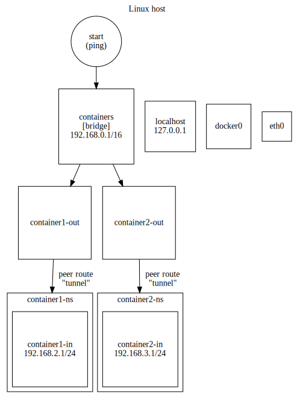

# The lying linux kernel (network namespaces)

## Getting started

```shell
sudo ../init
```

Run this command on a linux machine (also works in WSL environments) to setup the container-inspired network configuration.

_Please note: This command cannot be executed within container environments without granting it the `CAP_NET_ADMIN` capability on container startup.
Granting this permission will allow the container to alter its host's network configuration, providing no isolation whatsoever with regards to the scripts execution._

## How to explore the namespace environment

The network namespaces can be entered by using the `start-container1` and `start-container2` scripts.
They will open a new bash shell which process is bound to the respective network namespaces created by the `init` script.

Run `ip address list` to list all ip addresses that are bound to any of the interfaces the host environment provides.
It is to be noticed that the ip address `192.168.2.1` in itself is not bound to any of those interfaces.

Try pinging `ping 192.168.2.1` to observe that a device is replying to the ping request.
Given what has been observed before, one could conclude that some other device must have replied to the ping request.
In fact, the replying interface not a different device, it is just an interface in a different network namespace (`container1-ns`).
As the shell process is bound to the root namespace, the kernel did not report it back when it was asked for a list of all available network interfaces (via `ip address list`).

The same effect can be observed when running `ip address list` inside the network namespace.
It will yield a completely different network configuration, namely only a single interface named `container1-in`.
That interface is the virtual peer interface of `container1-out`.
Thus when inside the namespace one sends packets to the "physical interface", is is the root namespace and not a physical interface that receives them.

## What is happening under the hood



Executing the script will result in two network namespaces being set up, each of which contains one virtual interface.
Those "inner interfaces" are each connected to a peer interface ("outer interface"; similar to tunnels/pipes) that is outside of the respective, newly created network namespace and thus visible to the host environment.

To facilitate routing, they are held by a common bridge called `containers`.
The ip address that is being assigned to the bridge for the sake of routing must be of a subnet that is more coarse than those of the two inner interfaces.

Processes that are being executed in the root network namespace will not be able to observe the inner interfaces directly.
Whenever they address a packet to one of the inner interfaces, the `containers` bridge will broadcast it to the outer interfaces (due to the matching subnet) which will, in turn, forward it to the inner interfaces.
In the network namespaces, the respective inner interface is configured as the root route, letting it forward the network namespace's entire traffic that is not to be routed within the namespace itself to the host system.
